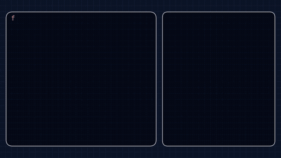

<p align="center"></p>

# Video-Code
The initial goal of this project is to create videos from code.<br>
I've always wanted to create millimetric videos and I will be able to, soon enough.

The second thought is that such thing can be used to automate the generation of video.<br>
AI have a hard time with designs, they are better with code, they could potentially take advantage of this project to generate videos with a good quality and a logical flow.

Thirdly, I want the program to have a visual interface like any other video editing app but I want it to be automatically generated from the Python API.<br>
With a code and a visual interface, anyone can make videos according to their liking.

Below is a tutorial example and its rendered preview video. The tutorial video was made with Videocode, and the source lives in `docs/by-example/tuto.py`.

<details>
<summary>Show tutorial code</summary>

```py
#!/usr/bin/env python3

from videocode import *
from videocode.template.effect.other.highlight import highlight
from videocode.template.input.YStack import Paragraphe
from videocode.template.input._inputs import *
from videocode.utils.bezier import _exponential, _exponentialDecay, _rushFrom, _smooth

PAUSE_DELAY = 0.4

# Splitted Screen
sv = SplitView(ratio=3 / 4)

# Left side as a Paragraph
para = Paragraphe(gap=0.18).position(x=sv.a.left, y=sv.a.top)

timestamp("code: create rectangle")
para.add(Code("from videocode import *")).newline()
para.add(textRect := Code("r = Rectangle(width=1.5, height=1)"))

timestamp("show: rectangle")
rect = Rectangle(width=1.5, height=1, cornerRadius=15, fillColor=BLUE_C, strokeColor=WHITE)
dims = RectangleDimensions(rect).opacity(0)
rect.position(sv.b.cx, sv.b.cy).opacity(0).waitFor(para).wait(PAUSE_DELAY).fadeIn()

timestamp("show: rectangle dimensions")
dims.waitFor(rect).wait(PAUSE_DELAY).fadeIn().flush()
rect.waitFor(dims).wait(PAUSE_DELAY)

timestamp("code: scale up rectangle")
para.waitFor(rect).add(textScale := Code("r.scaleTo(factor=2, duration=0.6)"))

timestamp("show: scale up rectangle")
rect.waitFor(para).wait(PAUSE_DELAY).easeTogether(
    (rect.ref.width, rect.width * 2),
    (rect.ref.height, rect.height * 2),
    duration=0.6,
)

timestamp("show: hide dimensions")
dims.waitFor(rect).wait(PAUSE_DELAY).fadeOut()

timestamp("code: change rect fillcolor to red")
para.waitFor(dims).wait(PAUSE_DELAY).newline()
para.add(textFill1 := Code("r.fill(LinearGradient(RED, BLUE))"))
para.add(textFill2 := Code("r.fill(LinearGradient(RED, GREEN))"))

timestamp("show: rect fillcolor to red")
rect.waitFor(para).wait(PAUSE_DELAY)
for p in Easing.ExponentialDecay.range(0, 100, duration=2.4):
    rect.fillColor = LinearGradient((RED_B, p), BLUE_C)
    rect.flush()
for p in Easing.ExponentialDecay.range(0, 50, duration=1.2):
    rect.fillColor = LinearGradient((RED_B, 100 - p), GREEN_A)
    rect.flush()


timestamp("show: cleanup")
pts = Group(textRect, textScale, textFill1, textFill2, rect).waitForOthers().fadeOut()
para.curY = 0
para.newline().newline()

# wait()
timestamp("text: balls")
para.waitFor(pts)
para.add(textp1 := Code("p1 = Circle(radius=0.25)"))
para.add(textp2 := Code("p2 = Circle(radius=0.25)"))
para.add(textp3 := Code("p3 = Circle(radius=0.25)"))
para.add(textBalls := Code("balls = XAlign(1.75, p1, p2, p3)"))
para.newline()


timestamp("show: balls")
rad = 0.25
gap = 1.75
w = rad + gap
p1 = Circle(radius=rad, fillColor=BLUE_C, strokeWidth=0.03)
p2 = Circle(radius=rad, fillColor=BLUE_C, strokeWidth=0.03)
p3 = Circle(radius=rad, fillColor=BLUE_C, strokeWidth=0.03)
ltop = DashedLine(x1=sv.b.cx - w, y1=sv.b.cy + 2.5 + rad, x2=sv.b.cx + w, y2=sv.b.cy + 2.5 + rad, strokeWidth=0.04, color=WHITE | 0.5)
lbot = DashedLine(x1=sv.b.cx - w, y1=sv.b.cy + 1 - rad, x2=sv.b.cx + w, y2=sv.b.cy + 1 - rad, strokeWidth=0.04, color=WHITE | 0.5)
t1 = Text("InOut", fontSize=0.2)
t2 = Text("ExpoDecay", fontSize=0.2)
t3 = Text("Expo", fontSize=0.2)

g1 = FunctionGraph(_smooth, (0, 1))
g2 = FunctionGraph(_exponentialDecay, (0, 1))
g3 = FunctionGraph(_exponential, (0, 1))

pts = XAlign[Circle](gap, p1, p2, p3).position(sv.b.cx, sv.b.cy + 1)
txt = XAlign(gap, t1, t2, t3).position(sv.b.cx, sv.b.cy)
grs = XAlign(gap, g1, g2, g3).position(sv.b.cx - 0.5, sv.b.cy - 1.5)
g = Group(ltop, lbot, pts, txt, grs).opacity(0).waitFor(para).wait(PAUSE_DELAY).fadeIn().wait(PAUSE_DELAY * 2)

timestamp("text: move balls")
para.waitFor(g).wait(PAUSE_DELAY)
para.add(textb1 := Code("for i, input in enumerate(balls):"))
para.add(textb2 := Code("    ease = [Smooth, ExpoDecay, Expo][i]"))
para.add(textb3 := Code("    input.moveBy(y=+1.5, easing=ease).flush()"))
para.add(textb4 := Code("    input.moveBy(y=-1.5, easing=ease).flush()"))


timestamp("show: move balls")
pts.waitFor(para).wait(PAUSE_DELAY * 2)
for i, input in enumerate(pts):
    ease = [Easing.Smooth, Easing.ExponentialDecay, Easing.Exponential][i]
    input.moveBy(y=1.5, easing=ease, duration=2).wait(PAUSE_DELAY).moveBy(y=-1.5, easing=ease, duration=2).flush()

timestamp("show: cleanup2")
g = Group(textp1, textp2, textp3, textBalls, textb1, textb2, textb3, textb4, g).waitForOthers().wait(PAUSE_DELAY * 2).fadeOut()
para.curY = 0
para.newline().newline()

timestamp("text: text")
para.add(textnbr1 := Code('nbr = Text("125376890123")')).newline()

timestamp("show: text")
nbr = Text("125376890123", fontSize=0.25).position(sv.b.x, sv.b.y).opacity(0).waitFor(para).fadeIn().flush()

timestamp("text: highlight")
para.waitFor(nbr).add(textnbr2 := Code('twelve = nbr.find("12")'))
para.add(textnbr3 := Code("twelve.apply(highlight()).flush()"))

timestamp("show: highlight text")
nbr.waitFor(para).wait(PAUSE_DELAY * 2).find("12").apply(highlight())
nbr.waitForOthers().wait(PAUSE_DELAY)

timestamp("text: highlight2")
para.waitFor(nbr).add(textnbr4 := Code("twelve.apply(highlight(scale=2, color=RED))")).newline()

timestamp("show: highlight text2")
nbr.waitFor(para).wait(PAUSE_DELAY).find("12").apply(highlight(scale=2, color=RED_B))

timestamp("text: radiant text")
para.waitFor(nbr).add(textnbr5 := Code("nbr.fill(LinearGradient(BLUE, RED)"))

timestamp("show: radiant text")
nbr.waitFor(para).wait(PAUSE_DELAY).fill(LinearGradient(BLUE_C, RED_B))

timestamp("show: cleanup3")
g = Group(nbr, textnbr1, textnbr2, textnbr3, textnbr4, textnbr5).waitForOthers().wait(PAUSE_DELAY * 2).fadeOut()
para.curY = 0
para.newline().newline()

timestamp("text: image")
para.waitFor(g).add(textImg1 := Code('img = Image("logo.png").fadeIn().scaleTo(2)')).newline()

timestamp("show: image")
img = Image("logo.png").position(sv.b.x, sv.b.y).opacity(0).waitFor(para).wait(PAUSE_DELAY).fadeIn().scaleTo(2).flush()

timestamp("text: image lightsweep")
para.waitFor(img).wait(PAUSE_DELAY).add(textImg2 := Code("img.apply(lightSweep(width=10), duration=2)")).newline()

timestamp("show: image lightsweep")
img.waitFor(para).wait(PAUSE_DELAY).apply(lightSweep(width=10), duration=1.6).flush()

timestamp("text: image blur")
para.waitFor(img).wait(PAUSE_DELAY).add(textImg3 := Code("img.apply(blur(5), duration=2)"))

timestamp("show: image blur")
img.waitFor(para).wait(PAUSE_DELAY).apply(blur(5), duration=2)

timestamp("show: cleanup4")
g = Group(textImg1, textImg2, textImg3, img).waitForOthers().wait(PAUSE_DELAY).fadeOut()

timestamp("show: square")
para.waitFor(g)
para.curY = 0
para.newline().newline().wait(PAUSE_DELAY).add(textG1 := Code("s = Square()"))
s = Square(side=1, cornerRadius=15, fillColor=BLUE_C, strokeColor=WHITE).opacity(0).waitFor(para).position(sv.b.x, sv.b.y).fadeIn()
timestamp("text: move square")
para.waitFor(s).wait(PAUSE_DELAY).add(textG2 := Code("s.moveBy(x=-1)"))
timestamp("show: move square")
s.waitFor(para).moveBy(x=-1.25)

timestamp("text: circle")
para.waitFor(s).wait(PAUSE_DELAY).add(textG3 := Code("c = Circle()"))
c = Circle(radius=0.5, fillColor=RED_B, strokeColor=WHITE).opacity(0).waitFor(para).position(sv.b.x, sv.b.y).fadeIn()
timestamp("text: move circle")
para.waitFor(c).wait(PAUSE_DELAY).add(textG4 := Code("c.moveBy(x=1)"))
timestamp("show: move circle")
c.waitFor(para).moveBy(x=1.25)

timestamp("text: group")
para.newline().waitFor(c).wait(PAUSE_DELAY).add(textG5 := Code("g = Group(s, c)"))
timestamp("text: group rotation")
para.add(textG6 := Code("g.rotateBy(180).flush()"))
timestamp("show: group rotation")
g = Group(s, c).waitFor(para).wait(PAUSE_DELAY).rotateBy(180, duration=1.2).flush()

timestamp("text: group scale down and rotate")
para.waitFor(g).wait(PAUSE_DELAY).add(textG7 := Code("g.scaleTo(0.5).rotateBy(180)"))
timestamp("show: group scale down")
g.waitFor(para).wait(PAUSE_DELAY).scaleTo(0.5, duration=1.2).rotateBy(180, duration=1.2)


# timestamp("show: cleanup5")
# g = Group(textG1, textG2, textG3, textG4, textG5, textG6, textG7, s, c).waitForOthers().wait(PAUSE_DELAY).fadeOut()
# para.curY = 0
# para.newline().newline()

# timestamp("show: text fire")
# title = Text("FIREPLACE", fontSize=1, fillColor=fire(speed=1)).position(sv.b.x, sv.b.y).opacity(0).waitFor(g).wait(PAUSE_DELAY).fadeIn()


# bg - created last so drift() starts at the end of existing content
para = Plane().drift()
```

</details>

<p>The preview below is the rendered tutorial video made with Videocode.</p>



## Getting Started
To create a video with Video-Code, you need to write some simple code in Python.

An __Input__ is anything on screen — a shape, a text, an image, a video, a sound — and creating one puts it there: `Rectangle(...)`, `Text("...")`, `Image("x.png")`, `Video("x.mp4")`. There is no separate "add" step.<br>
To modify it, call its methods — `position`, `fadeIn`, `moveTo`, `scaleTo` — each one an animation written on the timeline.<br>
To let time pass, call `wait(n)`: it waits for every running animation, then holds the picture for `n` seconds.

The smallest scene there is, `docs/by-example/firstRectangle.py`:

```py
from videocode import *

Rectangle(width=3, height=2, fillColor=BLUE_C, strokeColor=WHITE).fadeIn()

wait(1)
```

Render it, or open it in the editing shell — dock, timeline, properties and the scene's own buffer, which re-runs as you type:

```sh
./video-code --file docs/by-example/firstRectangle.py --generate first.mp4
./video-code --file docs/by-example/firstRectangle.py --editor
```

A scene is a Python program, and opening one runs it — in the editor as much as
on the command line. Read a scene you did not write before you open it, the way
you would any script someone sent you.

### Installation

The quickest way is a prebuilt folder — no compiler, no Qt, no Python to install:

```sh
curl -fsSL https://raw.githubusercontent.com/anpawo/Video-Code/main/scripts/install.sh | sh
```

It downloads the [latest release](https://github.com/anpawo/Video-Code/releases/latest)
for this machine — macOS on Apple Silicon, or Ubuntu 24.04 on x86_64 — into
`./video-code`, then renders one scene to prove it works. The only thing it asks
of the machine is `ffmpeg`: `brew install ffmpeg`, or on Ubuntu
`sudo apt install ffmpeg mesa-vulkan-drivers libvulkan1 libopengl0 libegl1 libglx0 libxkbcommon0 libopencv-imgcodecs406t64 libopencv-videoio406t64`.

To build from source instead, checkout the [documentation](docs/user/user.md#installation).

### Contributing

Nothing blocks a push. GitHub Actions checks types, the test suites, the build,
the QML, and whether new public API arrived documented and tested. It also
keeps the perf record: it cannot measure this renderer — a shared runner has no
GPU and rasterises ~30x slower — so the timings are measured here and travel in
the commit, and CI publishes the curve. What CI *can* measure exactly is what
the scenes ask the renderer to do, and it holds that to zero tolerance.

The two gates that need this machine's GPU — visual regression and the
performance baseline — are one command, run when you want them:

```bash
make check
```

Arm the pre-commit hook once per clone (coverage, types, the QML chrome, ~15s):

```bash
make arm
```

See [docs/WORKFLOWS.md](docs/WORKFLOWS.md) for what each gate can and cannot
decide, and how to re-baseline performance deliberately.

## Everything else

The full list of what a scene can use — every input, transformation, shader and
effect, with the file it lives in and a scene that exercises it — is
[docs/FEATURES.md](docs/FEATURES.md). What changed, and when, is `git log`.

## License

[PolyForm Noncommercial 1.0.0](LICENSE), with three permissions added on top
of it: the videos you make are yours to publish and monetise anywhere as long
as they credit

> made with https://mariusrousset.com/videocode

your scenes, templates and agent-written code stay entirely yours, and using
the tool for business -- client work, inside a product or a service -- is free
while your yearly revenue is under 100 000 EUR. Above that, a commercial
license costs **1 000 EUR per organisation per year**; write to
<rousset.marius13@gmail.com>.
